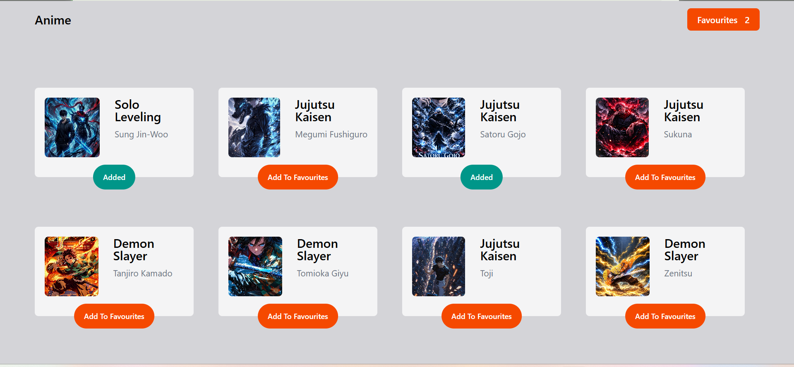
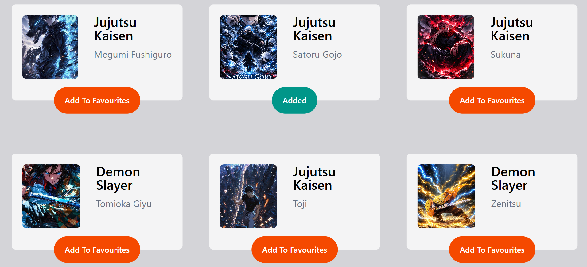

# ⚔️ Anime Favourites

> A React mini project built to practice core concepts — learning by building.


---

## 📖 About

A beginner-friendly React practice project — a grid of anime characters where you can add or remove your favourites. The favourite count updates live in the navbar. Built to understand core React concepts hands-on.

---

## 📸 Screenshots

| Default View | Cards |
|:---:|:---:|
|  |  |

---

## 🛠️ Tech Stack

| Technology | Docs |
|---|---|
| ⚛️ React 18 | [react.dev](https://react.dev) |
| 🎨 Tailwind CSS | [tailwindcss.com/docs](https://tailwindcss.com/docs) |
| ⚡ Vite | [vite.dev](https://vite.dev) |

---

## 🧠 React Concepts Practiced

### 1. `useState` Hook
`animeData` array lives in state. Toggling a card triggers a re-render that updates the entire UI instantly.
```jsx
const [animeData, setAnimeData] = useState(data)
```

---

### 2. Props Drilling
`data` and `handleClick` passed from `App` → `Card`. `data` passed `App` → `Navbar`. Child receives, never owns.
```jsx
<Navbar data={animeData}/>
<Card key={index} index={index} data={item} handleClick={handleClick}/>
```

---

### 3. Conditional Rendering
Button label and color change based on `added` flag using ternary expressions directly in JSX.
```jsx
{added === false ? "Add To Favourites" : "Added"}
```

---

### 4. List Rendering with `.map()`
`animeData.map()` renders Card components dynamically. Each item gets a `key` prop for React's diffing algorithm.
```jsx
{animeData.map((item, index) => (
  <Card key={index} index={index} data={item} handleClick={handleClick}/>
))}
```

---

### 5. Immutable State Update
State updated via `.map()` + spread operator. The original array is never mutated directly.
```jsx
setAnimeData((prev) => {
  return prev.map((item, itemIndex) => {
    if(itemIndex === index) return {...item, added: !item.added}
    return item;
  })
})
```

---

### 6. Derived State with `.filter()`
Favourite count is derived on each render — no separate counter state needed.
```jsx
data.filter(item => item.added).length
```

---

### 7. Component Decomposition
UI split into `App` (logic) → `Navbar` (display) + `Card` (display). Separation of concerns baked in.
```
App.jsx       → holds state and logic
Navbar.jsx    → displays title and favourite count
Card.jsx      → displays a single anime character card
```

---

### 8. Event Handling with Closures
`onClick={() => handleClick(index)}` captures `index` per card via closure — a classic pattern for list item handlers.
```jsx
<button onClick={() => handleClick(index)}>...</button>
```

---

## 📁 Project Structure

```
src/
  ├── components/
  │   ├── Card.jsx       // single anime card
  │   └── Navbar.jsx     // header + favourite count
  └── App.jsx            // state lives here
```
---

*Built while learning React — one concept at a time* ⚔️