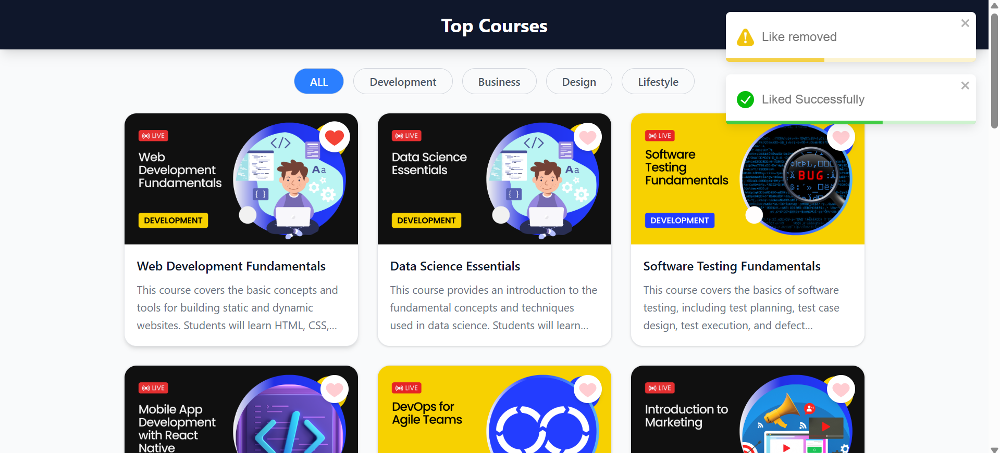
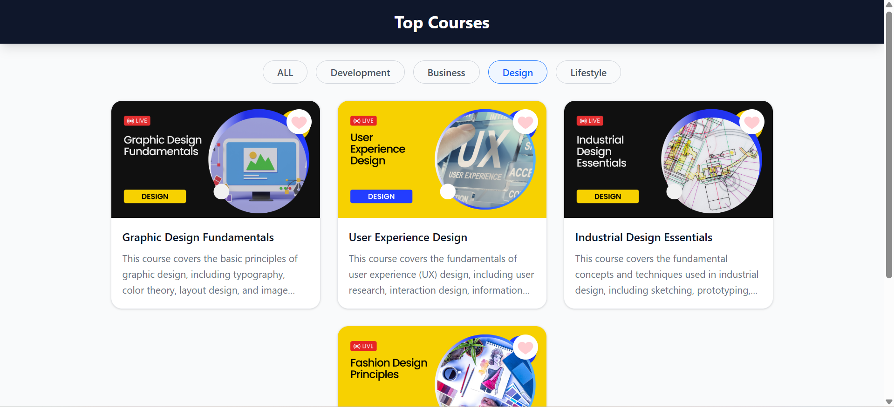

# 📚 Top Courses — React Mini Project

A React mini project built to practice core React concepts like API integration, state management, and component-based UI design. The app fetches real course data and displays filterable course cards with live badges and toast notifications.

---

## 🖼️ Preview

| All Courses | Design Filter |
|---|---|
|  |  |

> Courses are fetched from the **[Dot Batch Student Repo](https://github.com/dot-batch)** API and filtered by category in real time.

---

## ⚙️ Tech Stack

| Technology | Purpose |
|---|---|
| [](https://react.dev/) | UI Library |
| [](https://vitejs.dev/) | Build Tool & Dev Server |
| [](https://tailwindcss.com/) | Styling |
| [](https://fkhadra.github.io/react-toastify/) | Toast Notifications |

---

## ✨ Features

- 🔍 **Category Filtering** — Filter courses by ALL, Development, Business, Design, or Lifestyle
- ❤️ **Wishlist Button** — Heart icon on each course card
- 💛 **Dynamic Card Colors** — Cards alternate between dark and yellow themes
- 🔔 **Toast Notifications** — Error feedback via React Toastify on API failure
- ⏳ **Shimmer Loading UI** — Skeleton loader shown while data is being fetched

---

## 🧠 What I Practiced

### 🔁 API Calls with `useState` & `useEffect`

Fetching data from an external API and managing it with React hooks:

```jsx
const [courses, setCourses] = useState([]);
const [loading, setLoading] = useState(false);

const fetchData = async () => {
  setLoading(true);
  try {
    const res = await fetch(apiUrl);
    const data = await res.json();
    setCourses(data.data);
  } catch (error) {
    toast.error("Something went wrong");
  }
  setLoading(false);
};

useEffect(() => {
  fetchData();
}, []);
```

### 🔔 React Toastify

Displaying user-friendly error messages instead of crashing silently:

```jsx
import { toast } from "react-toastify";

toast.error("Something went wrong");
```

### 🧩 Component Composition

Breaking the UI into reusable components:

```
App.jsx
├── Navbar
├── Filter       ← category buttons
├── Cards        ← renders filtered course cards
└── Shimmer      ← loading skeleton
```

### 🗂️ State-Driven Filtering

Passing `category` state down as a prop to filter rendered courses without re-fetching:

```jsx
const [category, setCategory] = useState(filterData[0].name);

<Filter filterData={filterData} category={category} setCategory={setCategory} />
<Cards courses={courses} category={category} />
```

---

## 🚀 Getting Started

```bash
# Install dependencies
npm install

# Start development server
npm run dev
```

---

## 📌 Key Learnings

- Managing async API calls inside `useEffect` cleanly
- Controlled loading states to show shimmer UI
- Error handling with `try/catch` and toast feedback
- Prop drilling for shared state (`category`)
- Conditional rendering: `{loading ? <Shimmer /> : <Cards />}`

---

*Built with ❤️ for learning React fundamentals*