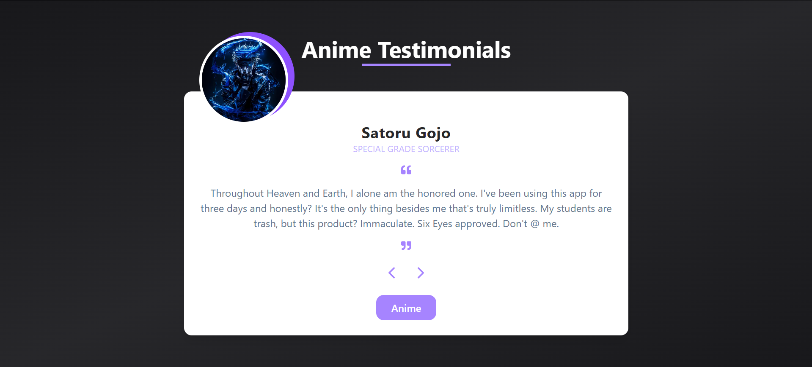

<div align="center">

# 🌀 Anime Testimonials

**A sleek testimonial carousel — built to master React fundamentals.**

<br/>

[](https://react.dev/)
[](https://tailwindcss.com/)

</div>

---

## ✦ Overview

A mini React project featuring fictional anime character testimonials — crafted as a focused exercise in component architecture, state management, and responsive UI design.

---

## ⚡ Features

- 🎴 &nbsp;Navigate testimonials with **Prev / Next** controls
- 🎲 &nbsp;**Surprise Me** — jump to a random character instantly
- 💜 &nbsp;Polished dark UI with smooth transitions
- 📱 &nbsp;Fully responsive across all screen sizes

---

## 🖼️ Preview



---

## 🛠️ Quick Start

```bash
npm install && npm run dev
```

---

<div align="center">
<sub>Built with focus. Powered by curiosity.</sub>
</div>